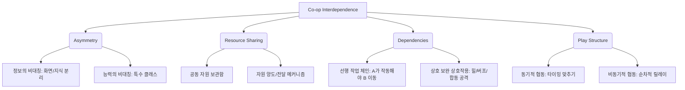

# Co-op Game Design & Interdependence Patterns (협동 게임 상호의존성 설계 가이드)

본 문서는 플레이어들이 유기적으로 협력하여 문제를 해결하게 만드는 **협동 게임(Co-op Game)**의 설계 핵심 원리와 상호의존성(Interdependence) 패턴에 관한 기획 가이드입니다. 플레이어들이 각자 자기 게임만 플레이하는 '평행 플레이(Parallel Play)' 현상을 극복하기 위한 구체적인 방법론을 제공합니다.

---

## 1. 협동 게임과 상호의존성(Interdependence)
협동 게임에서 상호의존성이란 **"목표 달성을 위해 플레이어들이 반드시 서로에게 의존해야 하는 기획적 장치"**를 의미합니다. 상호의존성이 약하면 멀티플레이는 단지 싱글플레이를 여러 명에서 동시에 하는 것에 불과해집니다.

### 1.1 핵심 개념
* **긍정적 상호의존성 (Positive Interdependence):**
  * "너의 성공이 나의 성공이고, 너의 실패가 나의 실패다"라는 일체형 보상 및 목표 시스템.
  * 개인의 이기적 플레이보다 팀의 이익을 추구할 때 최대의 효율을 내도록 규칙을 구성합니다.
* **역할 기반 상호의존성 (Role-Based Interdependence):**
  * 각 플레이어에게 고유의 능력, 역할, 또는 도구를 비대칭적으로 분배하여, 누구 한 명이 모든 일을 독점할 수 없게 만듭니다.

---

## 2. 상호의존성 설계의 4대 주요 패턴 범주
협동 게임 기획 시 아래 4가지 패턴을 응용하여 풍부한 협동 환경을 구축할 수 있습니다.

### 2.1 비대칭성 (Asymmetry)
플레이어들이 마주하는 정보나 실행할 수 있는 기능을 서로 다르게 설계하여 소통을 강제합니다.
* **정보 비대칭 (Information Asymmetry):** 한 플레이어는 퍼즐 힌트를 보지만 조작할 수 없고, 다른 플레이어는 조작은 가능하지만 힌트가 보이지 않는 구조 (예: *Keep Talking and Nobody Explodes*, *We Were Here*).
* **능력 비대칭 (Ability Asymmetry):** 돌격 캐릭터, 치료 캐릭터, 해킹 캐릭터 등 역할에 따른 행동 제한 (예: *It Takes Two*의 못과 망치 조합).

### 2.2 자원 공유 (Resource Sharing)
한정된 자원을 배분하거나 공동으로 사용하게 만들어 갈등과 협상을 유도합니다.
* **공유 풀 (Shared Pool):** 팀 전체가 하나의 체력 게이지나 탄약 상자를 공유하게 하여 개별 플레이어가 독식하지 못하도록 규제합니다.
* **자원 이동 (Resource Transfer):** 플레이어 간에 아이템을 집어 던지거나 건네주어 난관을 극복하게 합니다 (예: *Overcooked*에서 식재료를 던져 전달하기).

### 2.3 의존성 체인 (Dependencies)
어떤 액션을 수행하기 위해 반드시 다른 플레이어의 사전 액션이나 지속적인 지원이 필요한 설계입니다.
* **상호작용 잠금 (Action Locking):** 한 플레이어가 발판을 밟고 있어야만 다른 플레이어가 문을 통과할 수 있는 트리거 구조 (예: *Portal 2*).
* **상호 보조 (Mutual Support):** 상태 이상에 걸린 아군을 깨워주거나, 절벽에서 떨어지는 아군의 손을 잡아 끌어올려 주는 시스템.

### 2.4 플레이 구조 (Play Structure)
팀원들이 동시에 협동하는가(동기적), 혹은 교대로 협동하는가(비동기적)에 따른 플레이 타이밍 설계입니다.
* **동기적 합동 타이밍 (Synchronous Timing):** "셋, 둘, 하나" 신호에 맞춰 동시에 레버를 당겨야 작동하는 장치.
* **비동기적 릴레이 (Asynchronous Relay):** A가 원거리에서 저격을 통해 길을 열어주면, B가 전진하여 스위치를 켜고 다시 A의 생존 공간을 넓혀주는 교대 협력 방식.

---

## 3. 기획자를 위한 실무 고려사항
1. **자율성(Agency)과의 균형:**
   * 너무 잦은 강제 협력은 플레이어의 개별 숙련도 향상을 저해하고 답답함을 줄 수 있습니다. 솔로 플레이 구간과 협동 필수 구간의 템포를 적절히 조절해야 합니다.
2. **비언어적 소통 도구(Ping) 제공:**
   * 보이스 챗을 쓰지 않는 유저들을 위해 화면에 위치나 대상을 표시해주는 핑(Ping) 시스템이나 퀵 감정표현(Emote)을 필수적으로 갖추어야 합니다.
3. **트롤링 방지 장치:**
   * 한 명이 고의로 트롤링을 하더라도 전체 플레이가 완전히 막히지 않도록 우회로를 만들거나, 특정 플레이어를 강퇴/투표할 수 있는 안전장치가 필요합니다.
