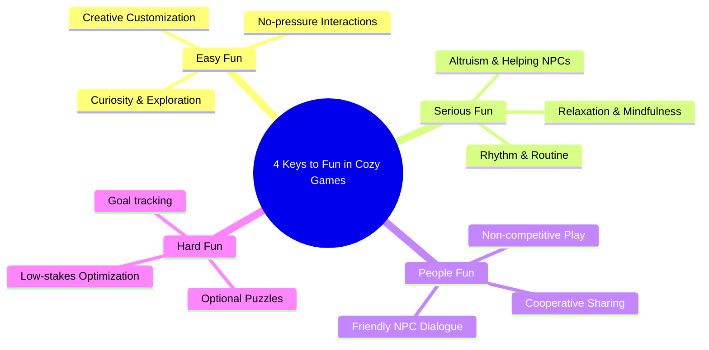

# Cozy Game Design & 4 Keys to Fun (감성/힐링 게임 설계 가이드)

본 문서는 플레이어에게 감성적 안정감과 긴장 완화를 제공하는 **코지 게임(Cozy Game)**의 설계 방식과, 니콜 라자로(Nicole Lazzaro)의 **4 Keys to Fun** 프레임워크를 결합한 기획 분석 자료입니다. 루시(Lucy) AI 비서의 기획 보조 자료로 활용될 수 있도록 체계적으로 정리되었습니다.

---

## 1. 코지 게임(Cozy Game) 디자인의 정의 및 핵심 가치
코지 게임은 전통적인 고자극, 경쟁, 실패의 압박에서 벗어나 **플레이어의 정서적 편안함(Comfort), 심리적 안전(Emotional Safety), 휴식(Relaxation)**을 핵심 경험으로 제공하는 장르입니다.

### 1.1 주요 설계 원칙
* **최소화된 위험과 실패 (Minimized Risk & Fail States):**
  * 게임 오버(Game Over)나 자원의 영구 손실과 같은 가혹한 패널티를 제거합니다.
  * 실수가 발생하더라도 단순한 시간적 지연이나 가벼운 롤백으로 처리하여 좌절감을 방지합니다.
* **자발적 페이싱 (Voluntary Pacing):**
  * 타임어택이나 실시간 압박을 배제합니다. 플레이어 스스로 콘텐츠를 소비하는 속도를 조절할 수 있게 합니다.
  * 낮과 밤의 순환이 있더라도, 시간이 지나감에 따라 강제적인 패널티를 주지 않고 환경의 분위기만 변화시킵니다.
* **내재적 동기부여 (Intrinsic Motivation):**
  * 점수나 순위표 같은 외재적 보상보다는 공간 꾸미기(하우징), 정원 가꾸기(가드닝), 탐험, 정서적 교감(NPC와의 대화) 등 활동 자체에서 오는 순수한 만족감을 제공합니다.
* **안전함, 풍요로움, 부드러움 (Safety, Abundance, Softness):**
  * **안전함:** 적대적 몬스터의 습격이나 영토 약탈 등 위협 요소를 배제합니다.
  * **풍요로움:** 자원이 항상 부족하여 생존을 위협받기보다, 조금만 노력하면 충분한 자원을 얻을 수 있도록 설계합니다.
  * **부드러움:** 파스텔톤의 비주얼, 둥근 모서리의 디자인, 평화롭고 잔잔한 사운드 트랙을 통해 감각적 자극을 낮춥니다.

---

## 2. Nicole Lazzaro의 4 Keys to Fun 프레임워크 적용
니콜 라자로의 4 Keys to Fun은 플레이어가 게임에서 느끼는 재미의 원천을 4가지 차원으로 분류합니다. 코지 게임은 이 중 특정 재미 요소에 집중하여 독창적인 흐름을 만들어냅니다.

### 2.1 Easy Fun (쉬운 재미 - 호기심과 탐험)
* **코지 게임에서의 역할:** 가장 핵심적인 요소입니다. 플레이어가 뚜렷한 목표 없이도 맵을 탐색하고 상호작용하는 재미를 줍니다.
* **적용 사례:** 숲 속에서 새로운 곤충이나 꽃을 발견하는 행동, 빈 방에 가구를 자유롭게 배치하는 활동 등. 호기심을 유발하되, 막다른 길이나 함정이 없어야 합니다.

### 2.2 Serious Fun (의미 있는 재미 - 가치와 정서)
* **코지 게임에서의 역할:** 단순한 오락을 넘어 플레이어에게 정서적 힐링이나 내적 만족을 줍니다. 반복적인 작업(Routine)이 주는 명상적 평화와 연관됩니다.
* **적용 사례:** 매일 아침 물을 주고 농작물을 수확하는 루틴, 아픈 동물을 치료하고 자연을 가꾸는 이타적 행동(Altruism)을 통해 플레이어는 스스로 가치 있는 행동을 하고 있다고 느낍니다.

### 2.3 People Fun (관계 중심 재미 - 정서적 교감)
* **코지 게임에서의 역할:** 타인과의 경쟁이 아닌, 협력과 대화를 통해 유대감을 느끼게 합니다. 싱글 플레이어 게임에서는 매력적이고 친절한 NPC와의 관계 형성으로 대체됩니다.
* **적용 사례:** NPC에게 선물을 주고 호감도를 올리며 그들의 사연을 듣는 시스템(예: 동물의 숲, 스타듀 밸리), 친구의 마을에 놀러 가 농작물을 수확해주거나 선물을 남겨두는 비경쟁적 멀티플레이어 요소.

### 2.4 Hard Fun (도전적 재미 - 목표와 장애물)
* **코지 게임에서의 역할:** 코지 게임에서 가장 주의해야 할 영역입니다. 지나치게 높은 난이도와 피지컬을 요구하는 도전은 코지 게임의 목적을 해칩니다.
* **적용 사례:** 아주 가벼운 퍼즐, 도감 채우기, 간단한 제작 레시피 해금 등 스트레스가 되지 않는 수준의 마일스톤(Goal)을 제시하여 지루함을 예방하는 윤활유 역할로만 제한적으로 사용합니다.

---

## 3. 코지 게임 기획을 위한 실무 체크리스트
감성/힐링 게임을 기획할 때 아래 요소를 점검하여 게임의 톤앤매너가 깨지지 않도록 해야 합니다.

1. [ ] **피로도 유발 요소 배제:** 스태미나(행동력) 시스템이 플레이어를 옥죄고 있지 않은가?
2. [ ] **시간 제한의 유연성:** 퀘스트나 이벤트에 엄격한 시간 제한이 있어 플레이어에게 FOMO(소외 불안 증후군)를 주지는 않는가?
3. [ ] **감각적 편안함:** 화면 흔들림(Camera Shake), 지나친 광원 효과, 급박한 템포의 오디오가 배제되었는가?
4. [ ] **직관적인 조작성:** 복잡한 콤보 입력이나 높은 타이밍 정확도를 요구하지 않고, 한 손이나 패드로도 편하게 플레이할 수 있는가?
5. [ ] **친화적 커뮤니티 디자인:** 멀티플레이어 도입 시 타인의 기물을 훼손하거나 훔치는 등의 트롤링(Griefing) 메커니즘이 원천 차단되어 있는가?
